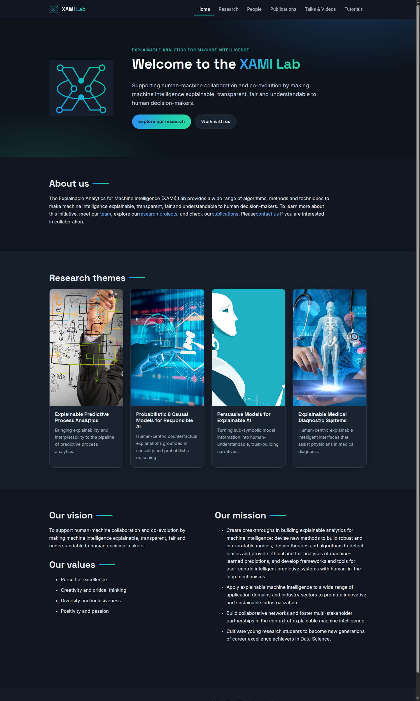
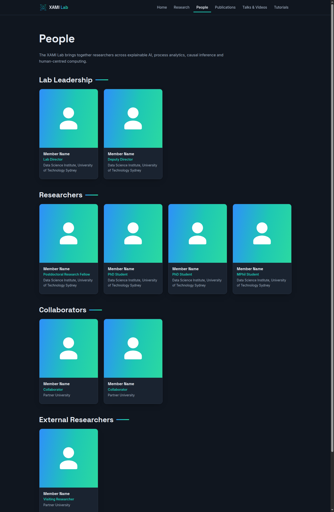
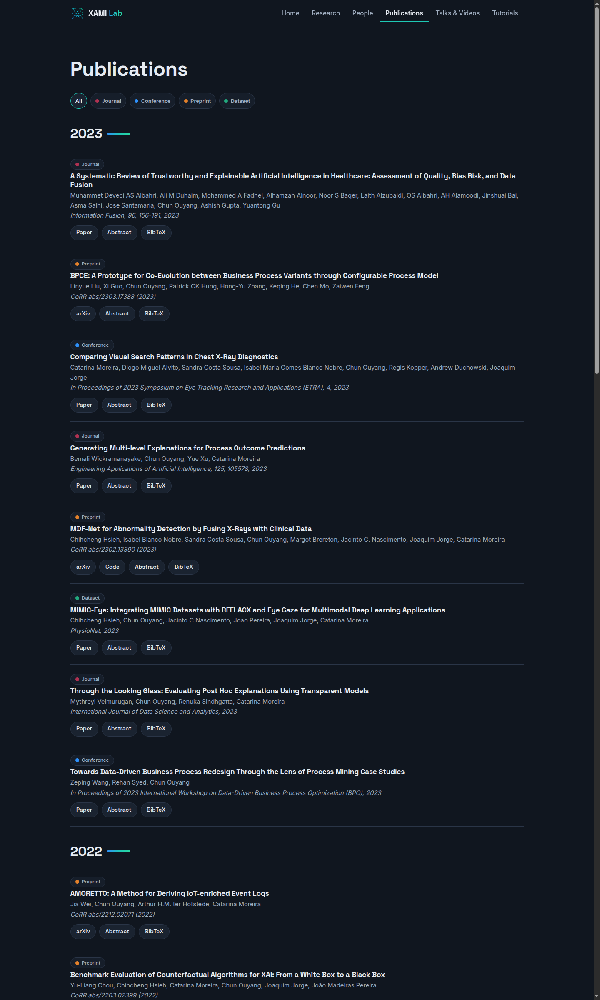

<div align="center">


# XAMI Lab - eXplainable Analytics for Machine Intelligence

**Supporting human-machine collaboration and co-evolution**

[](https://astro.build)
[](https://xami-lab-uts.github.io)
[](#-adding-content)

🌐 **[xami-lab-uts.github.io](https://xami-lab-uts.github.io)**

</div>

---

The official website of the **XAMI Lab** at the University of Technology Sydney.
We build algorithms, methods and techniques to make machine intelligence
explainable, transparent, fair and understandable to human decision-makers.

<div align="center">

</div>

## ✨ What's on the site

| Section | What it shows | Where the content lives |
|---|---|---|
| 🏠 **Home** | Mission, vision and research theme cards | `src/pages/index.astro` |
| 🔬 **Research** | Our four research themes | `src/content/projects/*.md` |
| 👩‍🔬 **People** | Lab leadership, researchers, collaborators | `src/content/people/*.md` |
| 📚 **Publications** | Filterable list with abstracts & BibTeX | `src/content/publications/*.yaml` |
| 🎬 **Talks & Videos** | Recorded talks and conference presentations | `src/content/videos/*.yaml` |
| 💻 **Projects** | Open-source code, tools and datasets | `src/content/code/*.yaml` |
| 📖 **Tutorials** (unlisted) | Hands-on guides, e.g. the contributing guide | `src/content/tutorials/*.md` |

<div align="center">
&nbsp;

</div>

## 📝 Adding content

**No coding needed.** Every person, publication, video and tutorial is a small
text file - add or edit files directly on GitHub and the site redeploys
automatically in ~2 minutes.

The full guide (with copy-paste templates) is published on the site itself:
**[Adding content to this website](https://xami-lab-uts.github.io/tutorials/adding-content-to-this-website/)**.

Quick example - a new publication is just `src/content/publications/2026-my-paper.yaml`:

```yaml
title: "Title of the Paper"
authors: "First Author, Second Author"
venue: "Journal Name, 2026"
year: 2026
type: journal   # journal | conference | preprint | dataset
doi: "https://doi.org/..."
```

## 🛠️ Developing locally

```bash
npm install       # once
npm run dev       # http://localhost:4321
npm run build     # production build into dist/
```

Built with [Astro](https://astro.build) - plain HTML/CSS output, no client
framework, fast by default. Deployed to GitHub Pages by
[`.github/workflows/deploy.yml`](.github/workflows/deploy.yml) on every push to
`main`.

## 🎨 Design

The visual identity follows the XAMI logo: deep navy `#141b26` with a
blue → teal gradient (`#2e90fa → #2bd9a1`), Space Grotesk headings and Inter
body text. Light and dark themes are both supported (the site follows the
visitor's system preference). Design tokens live in
[`src/styles/global.css`](src/styles/global.css).

## 📬 Contact

**XAMI Lab** · University of Technology Sydney
📧 [xamilab.uts@gmail.com](mailto:xamilab.uts@gmail.com)
